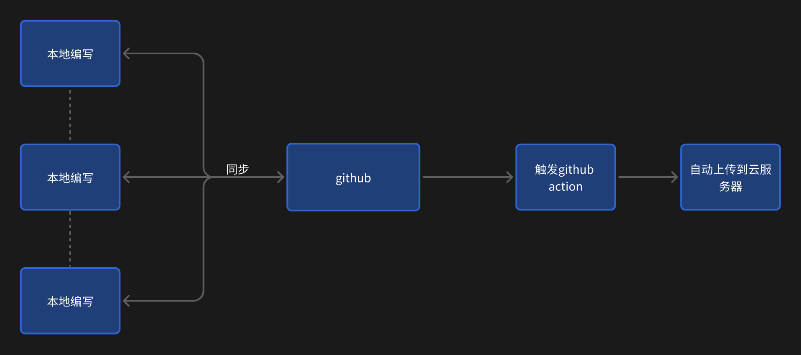

250925周四，小雨🌧️，刚锻炼完，革命尚未成功，仍需努力！

目前使用的是腾讯云的轻量级应用服务器，4核4g 3M带宽，活动79-1年，感觉用着一般，目前配置vscode或者trae等ide的时候，连ssh感觉总是会掉，自带的网页连接如果不使用tmux的话，用一段时间也会挂，总体体验感不是很好，感觉不如之前的阿里云，可惜没有新人优惠了。

那这几天体验下来，使用vscode等远程连接还是不太稳定，如果一直使用ssh体验感也不够现代，所以现在推荐的一套方案是在各本地设备进行编写，编写完后传入git服务器，传入后，使用github action进行同步。

但这个方案可能存在的缺陷如果报错重启，感觉有点麻烦，不过后面只修改文章内容的话，应该没啥大问题。同时，github网速过慢，同步可能出错。
在后面，能否自搭git服务器，主要考虑的是要不要搭建带图形化界面的，类似 gitea这样的，可以触发action这种，但对于资源要求感觉有点高。如果直接搭git，将git内容传入blog，感觉也可以，这样可以直接跳过github，主要是不想将有些内容放到国内的一些平台上，自己看看就可以了。
后面博客的内容，主要是修改评论的内容，更换waline的配置又需要折腾一下。对了，域名还没配置上去。